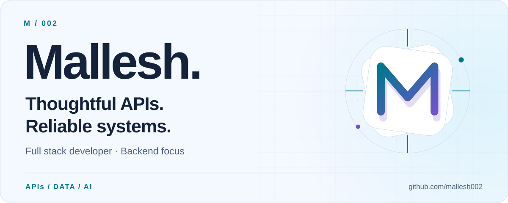
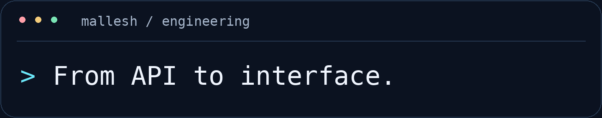
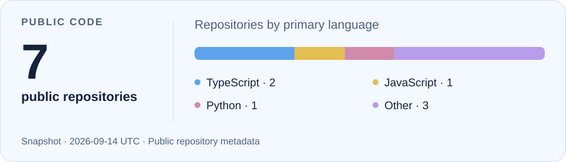

<picture>
  <source media="(max-width: 600px) and (prefers-color-scheme: dark)" srcset="./assets/hero-dark-mobile.svg">
  <source media="(max-width: 600px)" srcset="./assets/hero-light-mobile.svg">
  <source media="(prefers-color-scheme: dark)" srcset="./assets/hero-dark.svg">
  
</picture>

  <a href="#about-me">About</a> &nbsp;·&nbsp;
  <a href="#tech-stack">Stack</a> &nbsp;·&nbsp;
  <a href="#selected-engineering-work">Work</a> &nbsp;·&nbsp;
  <a href="#lets-connect">Connect</a>

  <picture>
    <source media="(prefers-reduced-motion: reduce)" srcset="./assets/intro-static.svg">
    
  </picture>

## About me

I’m **Mallesh**, a full stack developer with a strong backend focus. I work on career platforms that connect people with jobs, resume preparation, and interviews.

My work spans **Node.js APIs, MySQL performance, search relevance, and practical AI integrations**. I care about the details behind a feature: how its data is stored, how its queries behave, and how clearly another developer can understand the code.

Alongside development, I review pull requests, support deployments, and help translate requirements into practical implementation plans.

## Tech stack

**Backend & data**

  <picture><source media="(prefers-color-scheme: dark)" srcset="./assets/stack/nodedotjs-dark.svg"></picture>
  <picture><source media="(prefers-color-scheme: dark)" srcset="./assets/stack/typescript-dark.svg"></picture>
  <picture><source media="(prefers-color-scheme: dark)" srcset="./assets/stack/express-dark.svg"></picture>
  <picture><source media="(prefers-color-scheme: dark)" srcset="./assets/stack/mysql-dark.svg"></picture>
  <picture><source media="(prefers-color-scheme: dark)" srcset="./assets/stack/drizzle-dark.svg"></picture>

**Frontend**

  <picture><source media="(prefers-color-scheme: dark)" srcset="./assets/stack/react-dark.svg"></picture>
  <picture><source media="(prefers-color-scheme: dark)" srcset="./assets/stack/tailwindcss-dark.svg"></picture>
  <picture><source media="(prefers-color-scheme: dark)" srcset="./assets/stack/reactquery-dark.svg"></picture>

**Delivery & operations** &nbsp; Git · GitHub Actions · AWS EC2 / RDS · PM2

## Where I contribute

- **Backend architecture** — TypeScript APIs, clear controller and data-access boundaries, and maintainable business logic.
- **Database performance** — Index design, query analysis, FULLTEXT search, partitioning, archival, and batch migrations in MySQL.
- **Search & AI workflows** — Keyword retrieval, relevance scoring, deterministic filters, and LLM-assisted validation.
- **Technical delivery** — PR reviews, deployment support, production troubleshooting, and coordination across teams.

## Selected engineering work

### 01 / Job discovery & matching

Work on pipelines that connect candidate preferences and target roles with relevant jobs. My focus includes **MySQL FULLTEXT retrieval, weighted title and description relevance, experience filters, and job-expiry rules**.

I’m also working on LLM-based title validation between retrieval and candidate-to-job mapping to check role alignment.

`Search relevance` `Backend workflows` `AI integration`

<!-- PROJECT_JOB_DISCOVERY: Replace the URL and remove this comment wrapper when a public link is ready.
[Repository or case study](REPLACE_JOB_DISCOVERY_URL)
-->

### 02 / MySQL performance & data lifecycle

Work on growing datasets through **index tuning, monthly partitioning, archival, and separating large content fields from frequently queried records**. Related work includes batch migrations and scheduled data synchronization.

The goal: keep everyday queries efficient while making data maintenance manageable.

`MySQL` `Query optimization` `Data operations`

<!-- PROJECT_DATABASE: Replace the URL and remove this comment wrapper when a public link is ready.
[Repository or case study](REPLACE_DATABASE_CASE_STUDY_URL)
-->

### 03 / Resume & interview platforms

Develop backend workflows connecting **candidate profiles, resume preparation, job applications, and interviews**. I work across API behavior, data models, and frontend integration to turn requirements into usable features.

`Node.js` `Drizzle ORM` `Full stack delivery`

<!-- PROJECT_CAREER_WORKFLOWS: Replace the URL and remove this comment wrapper when a public link is ready.
[Repository or case study](REPLACE_CAREER_WORKFLOWS_URL)
-->

## How I build

**Understand the requirement. Model the data. Measure the query. Review the change.**

I prefer clear code, explicit trade-offs, and optimizations backed by evidence. Clean architecture matters most when it makes the next change easier to understand and ship.

## Public code

[Explore my repositories →](https://github.com/mallesh002?tab=repositories)

  
View my public GitHub snapshot

 

<picture>
  <source media="(max-width: 600px) and (prefers-color-scheme: dark)" srcset="./assets/github-stats-dark-mobile.svg">
  <source media="(max-width: 600px)" srcset="./assets/github-stats-light-mobile.svg">
  <source media="(prefers-color-scheme: dark)" srcset="./assets/github-stats-dark.svg">
  
</picture>

Language counts describe public repository metadata, not skill proficiency. [View the snapshot data](./assets/github-stats.json).

## Let’s connect

Interested in backend engineering, database performance, search systems, or practical AI integrations? Let’s compare notes.

**[GitHub](https://github.com/mallesh002)**

<!-- CONTACT_LINKS: Replace the values below, then remove this comment wrapper.
[LinkedIn](REPLACE_LINKEDIN_URL) · [Portfolio](REPLACE_PORTFOLIO_URL) · [Email](mailto:REPLACE_PUBLIC_EMAIL)
-->

 

<picture>
  <source media="(prefers-color-scheme: dark)" srcset="./assets/footer-dark.svg">
  
</picture>
